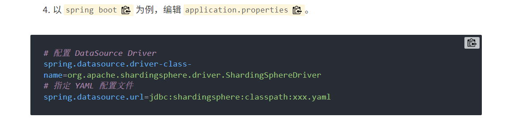

# ShardingSphere 学习笔记

## 一、ShardingSphere 简介

ShardingSphere 是一套开源的分布式数据库中间件解决方案组成的生态圈，它由 JDBC、Proxy 和 Sidecar（规划中）这 3 款相互独立，
却又能够混合部署使用的多款产品组成。它们均提供标准化的数据分片、分布式事务和数据库治理功能，可适用于如 Java
同构、异构语言、云原生等各种多样化的应用场景。

额~这是个ai自动生成的解释，对于我来说，ShardingSphere只是一个分库分表中间件

## 使用

**当前测试使用ShardingSphere5.5.2 和SpringBoot3.5.11 SpringBoot2.x的可能要使用较老的版本**

**在使用ShardingSphere前必须吐槽 ShardingSphere与SpringBoot的兼容以及ShardingSphere官方文档简直操蛋~~**

### 引用依赖

~~~xml

<properties>
    <project.build.sourceEncoding>UTF-8</project.build.sourceEncoding>
    <spring-boot.version>3.5.11</spring-boot.version>
</properties>

<dependencyManagement>
<dependencies>
    <dependency>
        <groupId>org.springframework.boot</groupId>
        <artifactId>spring-boot-dependencies</artifactId>
        <version>${spring-boot.version}</version>
        <type>pom</type>
        <scope>import</scope>
    </dependency>
</dependencies>
</dependencyManagement>

<dependencies>
<dependency>
    <groupId>org.springframework.boot</groupId>
    <artifactId>spring-boot-starter</artifactId>
</dependency>
<dependency>
    <groupId>org.springframework.boot</groupId>
    <artifactId>spring-boot-starter-test</artifactId>
    <scope>test</scope>
</dependency>
<dependency>
    <groupId>org.apache.shardingsphere</groupId>
    <artifactId>shardingsphere-jdbc</artifactId>
    <version>5.5.2</version>
</dependency>
<dependency>
    <groupId>org.yaml</groupId>
    <artifactId>snakeyaml</artifactId>
    <version>2.2</version>
</dependency>
<dependency>
    <groupId>com.alibaba</groupId>
    <artifactId>druid</artifactId>
    <version>1.2.24</version>
</dependency>
<!-- mysql连接驱动 -->
<dependency>
    <groupId>mysql</groupId>
    <artifactId>mysql-connector-java</artifactId>
    <version>8.0.33</version>
</dependency>
<!-- mybatisplus依赖 -->
<dependency>
    <groupId>com.baomidou</groupId>
    <artifactId>mybatis-plus-spring-boot3-starter</artifactId>
    <version>3.5.15</version>
</dependency>
<dependency>
    <groupId>junit</groupId>
    <artifactId>junit</artifactId>
    <version>4.13.2</version>
    <scope>test</scope>
</dependency>
<dependency>
    <groupId>org.projectlombok</groupId>
    <artifactId>lombok</artifactId>
    <scope>provided</scope>
</dependency>
</dependencies>
<build>
<resources>
    <resource>
        <directory>src/main/resources</directory>
        <includes>
            <include>**/*.properties</include>
            <include>**/*.xml</include>
            <include>**/*.yaml</include> <!-- 确保包含 YAML 文件 -->
            <include>**/*.yml</include>
        </includes>
    </resource>
</resources>
<plugins>
    <plugin>
        <groupId>org.apache.maven.plugins</groupId>
        <artifactId>maven-compiler-plugin</artifactId>
        <version>3.11.0</version>
        <configuration>
            <source>17</source>
            <target>17</target>
        </configuration>
    </plugin>
</plugins>
</build>
~~~

### 特殊配置

#### 配置文件加载

根据官网的配置 需要在 application.properties 中配置

~~~properties
# 配置 DataSource Driver
spring.datasource.driver-class-name=org.apache.shardingsphere.driver.ShardingSphereDriver
# 指定 YAML 配置文件
spring.datasource.url=jdbc:shardingsphere:classpath:xxx.yaml
~~~

如果你跟着这个来，那就恭喜了，一用一个不吱声

经过伟大的CSDN大佬提示，通过配置类来配置shardingsphere 配置类的位置

~~~ java
package com.lg.config;

import org.apache.shardingsphere.driver.api.yaml.YamlShardingSphereDataSourceFactory;
import org.springframework.beans.factory.annotation.Value;
import org.springframework.context.annotation.Bean;
import org.springframework.context.annotation.Configuration;
import org.springframework.core.io.ClassPathResource;
import org.springframework.core.io.Resource;

import javax.sql.DataSource;
import java.io.IOException;
import java.io.InputStream;
import java.sql.SQLException;

/**
 * @PackageName: com.lg.config
 * @ClassName: ShardingConfig
 * @Description: dev
 * @author: lg
 * @data: 2026/3/10 16:20
 */
@Configuration
public class ShardingConfig {
    @Value("${spring.profiles.active}")
    private String active;

    @Bean
    public DataSource initShardingSphereDataSource() throws SQLException, IOException {
        Resource resource = new ClassPathResource("shardingsphere-config-" + active + ".yaml");
        // 检查资源是否存在
        if (!resource.exists()) {
            throw new IOException("配置文件不存在: shardingsphere-config-" + active + ".yaml");
        }
        // 通过 InputStream 读取配置,**如果通过file读取打包后会报错**
        try (InputStream inputStream = resource.getInputStream()) {
            // 使用 ShardingSphere 的 YAML 工厂创建数据源
            return YamlShardingSphereDataSourceFactory.createDataSource(inputStream.readAllBytes());
        }
    }
}
~~~

配置文件放到 resource下面 ，为了确保会加载这个配置文件，在pom中添加下面内容

~~~ xml
<resources>
    <resource>
        <directory>src/main/resources</directory>
        <includes>
            <include>**/*.properties</include>
            <include>**/*.xml</include>
            <include>**/*.yaml</include> <!-- 确保包含 YAML 文件 -->
            <include>**/*.yml</include>
        </includes>
    </resource>
</resources>
~~~

## 数据分片（分库分表）

#### 配置文件内容

~~~yaml
# =============================================================================
# Apache ShardingSphere 分库分表配置文件
# =============================================================================
# 该配置文件定义了数据源、分片策略、分布式主键等核心配置
# 用于实现数据库的水平拆分（分库分表）功能
# =============================================================================

# -----------------------------------------------------------------------------
# 运行模式配置
# -----------------------------------------------------------------------------
# 定义 ShardingSphere 的运行模式和数据存储方式
mode:
  # 单机模式：适用于单体应用，元数据存储在本地的 JDBC Repository 中
  type: Standalone
  # 元数据存储仓库类型：使用 JDBC 方式存储分片规则等元数据信息
  repository:
    type: JDBC

# -----------------------------------------------------------------------------
# 数据源配置
# -----------------------------------------------------------------------------
# 定义实际参与分片的物理数据源
# ds_0 对应 sharding1 数据库，ds_1 对应 sharding2 数据库
dataSources:
  # 第一个数据源：sharding1 数据库
  ds_0:
    dataSourceClassName: com.alibaba.druid.pool.DruidDataSource
    driverClassName: com.mysql.cj.jdbc.Driver
    url: jdbc:mysql://localhost:3306/sharding1?autoReconnect=true&autoReconnectForPools=true&useUnicode=true&characterEncoding=utf-8&useSSL=false&serverTimezone=Asia/Shanghai&zeroDateTimeBehavior=convertToNull
    username: root
    password: 1

  # 第二个数据源：sharding2 数据库
  ds_1:
    dataSourceClassName: com.alibaba.druid.pool.DruidDataSource
    driverClassName: com.mysql.cj.jdbc.Driver
    url: jdbc:mysql://localhost:3306/sharding2?autoReconnect=true&autoReconnectForPools=true&useUnicode=true&characterEncoding=utf-8&useSSL=false&serverTimezone=Asia/Shanghai&zeroDateTimeBehavior=convertToNull
    username: root
    password: 1

# -----------------------------------------------------------------------------
# 分片规则配置
# -----------------------------------------------------------------------------
# 定义数据分片的核心规则，包括分表策略、分库策略、分布式主键等
rules:
  # 启用分片规则配置
  - !SHARDING
    # 指定默认数据源，所有未配置分片规则的表都存储在这里
    defaultDataSourceName: ds_0
    # 分片表配置
    tables:
      # course 课程表的完整分片配置
      course:
        # 真实数据节点映射表达式
        # ds_${0..1} 表示 ds_0 和 ds_1 两个数据源
        # course_${1..2} 表示每个库中的 course_1 和 course_2 两张表
        # 组合后共 4 个真实表：ds_0.course_1, ds_0.course_2, ds_1.course_1, ds_1.course_2
        actualDataNodes: ds_${0..1}.course_${1..2}

        # 分库策略：根据 cid 决定去 ds_0 还是 ds_1
        databaseStrategy:
          # 标准分片策略：适用于单分片键场景
          standard:
            # 分片键：用于计算路由到哪个数据库的字段
            shardingColumn: cid
            # 分片算法名称：引用下方 shardingAlgorithms 中定义的 database_inline 算法
            shardingAlgorithmName: database_inline

        # 分表策略：根据 cid 决定去 course_1 还是 course_2
        tableStrategy:
          # 标准分片策略：适用于单分片键场景
          standard:
            # 分片键：用于计算路由到哪个表的字段
            shardingColumn: cid
            # 分片算法名称：引用下方 shardingAlgorithms 中定义的 course_inline 算法
            shardingAlgorithmName: course_inline

        # 分布式主键生成策略配置
        keyGenerateStrategy:
          # 主键字段名
          column: cid
          # 主键生成器名称：引用下方 keyGenerators 中定义的 snowflake 雪花算法
          keyGeneratorName: snowflake

    # 分片算法定义
    shardingAlgorithms:
      # 数据库分片算法：决定数据路由到哪个数据库
      database_inline:
        # 行表达式内联算法：使用 Groovy 表达式进行分片计算
        type: INLINE
        # 算法属性配置
        props:
          # 分片算法表达式：cid 对 2 取模，结果为 0 路由到 ds_0，结果为 1 路由到 ds_1
          algorithm-expression: ds_${cid % 2}

      # 课程表分表算法：决定数据路由到哪个表
      course_inline:
        # 行表达式内联算法：使用 Groovy 表达式进行分片计算
        type: INLINE
        # 算法属性配置
        props:
          # 分片算法表达式：cid 先整除 2 再对 2 取模，最后加 1，结果映射到 course_1 或 course_2
          # 示例：cid=0~1 → course_1, cid=2~3 → course_2, cid=4~5 → course_1, 以此类推
          algorithm-expression: course_${(cid.intdiv(2) % 2) + 1}

    # 分布式主键生成器定义
    keyGenerators:
      # 雪花算法生成器：生成分布式唯一 ID
      snowflake:
        # 使用 Snowflake 雪花算法
        type: SNOWFLAKE
~~~

**有一个问题？这里进行了分库分表操作，那么如果我一个系统中只是少量表由于数据量太大导致需要分库分表，
但是其他数据是正常数据不需要这样的操作我该怎么办呢？**

在 ShardingSphere 中，ai给出的说法是 ： 
这种情况会默认将数据写入第一个数据源中，所以把其他表放在第一个数据中即可 
但是这种方案经过验证其实是不行的，在当前版本 5.5.2中会报错 
解决方案是 

* 指定表的数据节点

~~~yaml

# ... existing code ...

# 分片表配置
tables:
  # course 课程表的完整分片配置
  course:
    # 真实数据节点映射表达式
    # ds_${0..1} 表示 ds_0 和 ds_1 两个数据源
    # course_${1..2} 表示每个库中的 course_1 和 course_2 两张表
    # 组合后共 4 个真实表：ds_0.course_1, ds_0.course_2, ds_1.course_1, ds_1.course_2
    actualDataNodes: ds_${0..1}.course_${1..2}

    # 分库策略：根据 cid 决定去 ds_0 还是 ds_1
    databaseStrategy:
      # 标准分片策略：适用于单分片键场景
      standard:
        # 分片键：用于计算路由到哪个数据库的字段
        shardingColumn: cid
        # 分片算法名称：引用下方 shardingAlgorithms 中定义的 database_inline 算法
        shardingAlgorithmName: database_inline

    # 分表策略：根据 cid 决定去 course_1 还是 course_2
    tableStrategy:
      # 标准分片策略：适用于单分片键场景
      standard:
        # 分片键：用于计算路由到哪个表的字段
        shardingColumn: cid
        # 分片算法名称：引用下方 shardingAlgorithms 中定义的 course_inline 算法
        shardingAlgorithmName: course_inline

    # 分布式主键生成策略配置
    keyGenerateStrategy:
      # 主键字段名
      column: cid
      # 主键生成器名称：引用下方 keyGenerators 中定义的 snowflake 雪花算法
      keyGeneratorName: snowflake

  # user 用户表配置：只在 ds_0 中，不分库分表
  user:
    # 真实数据节点：只指向 ds_0
    actualDataNodes: ds_0.user

# ... existing code ...
~~~

**这种使方式缺陷特别严重，比如我有500张表其实只在ds_0数据源中，那么我也要配置500次吗？但是在5.5.2中，就是这个鬼样子**

## 广播表

广播表，即所有表在所有数据库中都有一份完全相同的副本，比如字典表、配置表等。 
广播表在所有数据源中都进行读写操作，因此广播表的所有操作都是全局的，与分库分表无关。

~~~yaml
rules:
  - !BROADCAST
    tables:
      - user
~~~

配置广播表后，插入数据时，每个数据源中的表中都会插入全部的数据；查询时，经过测试 会随机查询某个数据源中的数据