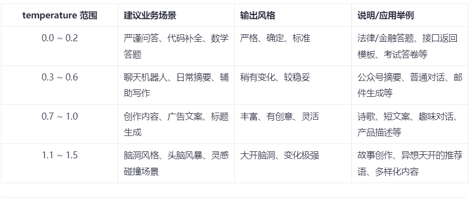

# Spring Ai

## 基本使用

### 1.引入依赖

目前(2026年1月30日)的最新版本是1.1.2，spring ai 支持 spring Boot 3.4.x 和 3.5.x.

~~~xml

<dependencyManagement>
    <dependencies>
        <dependency>
            <groupId>org.springframework.ai</groupId>
            <artifactId>spring-ai-bom</artifactId>
            <version>1.1.2</version>
            <type>pom</type>
            <scope>import</scope>
        </dependency>
    </dependencies>
</dependencyManagement>
~~~

### 2.引入需要使用的模型 如 deepseek

~~~xml

<dependency>
    <groupId>org.springframework.ai</groupId>
    <artifactId>spring-ai-starter-model-deepseek</artifactId>
</dependency>
~~~

### 3、配置相关参数

~~~yaml
spring:
  ai:
    deepseek:
      api-key: ${DEEP_SEEK_KEY}
      chat:
        options:
          model: deepseek-chat
~~~

### 4、基本使用

~~~java

@Test
public void testChat(@Autowired
                     DeepSeekChatModel chatModel) {
    String call = chatModel.call("你好");
    System.out.println(call);
}
~~~

#### options 配置项

* temperature（温度）

~~~text
0-2  浮点数值 
控制生成文本的随机性。值越高，生成的文本越随机，值越低，生成的文本越确定。默认值是0.9。
实战用法一般建议选 0.5~0.8 作为日常生产起点，需要根据业务不断测试调整。
~~~

#### maxTokens（最大token数）

~~~text
默认低 token
maxTokens：限制AI模型生成的最大token数（近似理解为字数上限）。
● 需要简洁回复、打分、列表、短摘要等，建议小值（如10~50）。
● 防止用户跑长对话导致无关内容或花费过多token费用。
● 如果遇到生成内容经常被截断，可以适当配置更大maxTokens。
~~~

#### stop （停止条件）

截断不想生成的内容 如下

~~~yaml
server:
  port: 8666
spring:
  application:
    name: spring-ai-test
  ai:
    deepseek:
      api-key: ${DEEP_SEEK_KEY}
      chat:
        options:
          model: deepseek-chat
          max-tokens: 1024 # 生成文本的最大长度
          stop:
            - "\n" # 生成文本的结束标志 只想一行
            - "。" # 生成文本的结束标志 只想一句话
            - "政治" #敏感词
            - "最后最总结一下"  #这种AI惯用的模板词， 减少AI词汇， 让文章更拟人
~~~

#### 模型推理

设置深度思考，思考的内容有个专业名词: Chain of Thought (CoT)
在deepseek中， deepseek-reasoner模型是深度思考模型
可以在代码中设置

~~~java
 /**
 * 推理模型(非流式)
 */
@Test
public void deepSeekReasonerExample() {
    DeepSeekChatOptions options = DeepSeekChatOptions.builder()
            .model("deepseek-reasoner").build();
    Prompt prompt = new Prompt("请写一句诗描写清晨", options);
    ChatResponse call = chatModel.call(prompt);
    DeepSeekAssistantMessage assistantMessage = (DeepSeekAssistantMessage) call.getResult().getOutput();
    String reasoningContent = assistantMessage.getReasoningContent();
    String content = assistantMessage.getText();
    System.out.println("推理内容: " + reasoningContent);
    System.out.println("====================================================================");
    System.out.println("输出内容: " + content);
}

/**
 * 推理模型(流式)
 */
@Test
public void deepSeekReasonerStreamExample() {
    DeepSeekChatOptions options = DeepSeekChatOptions.builder()
            .model("deepseek-reasoner").build();
    Prompt prompt = new Prompt("请写一句诗描写清晨", options);
    Flux<ChatResponse> stream = chatModel.stream(prompt);
    stream.toIterable().forEach(response -> {
        DeepSeekAssistantMessage assistantMessage = (DeepSeekAssistantMessage) response.getResult().getOutput();
        String reasoningContent = assistantMessage.getReasoningContent();
        System.out.print(reasoningContent);
    });
    System.out.println("--------------------------------------------");
    stream.toIterable().forEach(response -> {
        DeepSeekAssistantMessage assistantMessage = (DeepSeekAssistantMessage) response.getResult().getOutput();
        String content = assistantMessage.getText();
        System.out.print(content);
    });
}
~~~

也可以在配置文件中直接配置

~~~text
spring.ai.deepseek.chat.options.model= deepseek-reasoner
~~~

### 阿里百炼

依赖

~~~xml

<dependencyManagement>
    <dependencies>
        <dependency>
            <groupId>com.alibaba.cloud.ai</groupId>
            <artifactId>spring-ai-alibaba-bom</artifactId>
            <version>1.1.2.0</version>
            <type>pom</type>
            <scope>import</scope>
        </dependency>
    </dependencies>
</dependencyManagement>
<dependencies>
<dependency>
    <groupId>com.alibaba.cloud.ai</groupId>
    <artifactId>spring-ai-alibaba-starter-dashscope</artifactId>
    <version>1.1.2.0</version>
</dependency>
</dependencies>
~~~

配置文件

~~~yaml
server:
  port: 8666
spring:
  application:
    name: spring-ai-test
  ai:
    dashscope:
      api-key: ${AI_DASHSCOPE_API_KEY}
~~~

### ollama

依赖

~~~xml

<dependency>
    <groupId>org.springframework.ai</groupId>
    <artifactId>spring-ai-starter-model-ollama</artifactId>
</dependency>
~~~

配置

~~~yaml
server:
  port: 8666
spring:
  application:
    name: spring-ai-test
  ai:
    ollama:
      base-url: http://localhost:11434
      chat:
        model: qwen3:8b
~~~

### ChatClient

ChatClient 基于ChatModel进行了封装提供了通用的 API，它适用所有的大模型， 使用ChatClient可以让你面向SpringAi通用的api
而无需面向为每一种不同的模型的api来进行编程，虽然您仍然可以使用 ChatModel 来实现某些模型更加个性化的操作（ChatModel更偏向于底层），
但 ChatClient 提供了灵活、更全面的方法来构建您的客户端选项以与模型进行交互： 比如系统提示词、格式式化响应、聊天记忆 、tools
都更加易用和优雅，所以除非ChatClient无法实现，否则我们优先考虑用ChatClient。

~~~java 例子
package com.lg;

import com.alibaba.cloud.ai.dashscope.chat.DashScopeChatModel;
import org.junit.jupiter.api.Test;
import org.springframework.ai.chat.client.ChatClient;
import org.springframework.ai.deepseek.DeepSeekChatModel;
import org.springframework.ai.ollama.OllamaChatModel;
import org.springframework.beans.factory.annotation.Autowired;
import org.springframework.boot.test.context.SpringBootTest;
import reactor.core.publisher.Flux;

/**
 * @PackageName: com.lg
 * @ClassName: ChatClientTest
 * @Description:
 * @author: lg
 * @data: 2026/2/28 12:12
 */
@SpringBootTest
public class ChatClientTest {
    @Autowired
    private DashScopeChatModel dashScopeChatModel;
    @Autowired
    private DeepSeekChatModel deepSeekChatModel;
    @Autowired
    private OllamaChatModel ollamaChatModel;

    @Test
    public void testChatOptions() {
        ChatClient chatClient = ChatClient.builder(ollamaChatModel).build();
        String content = chatClient.prompt()
                .user("你好")
                .call()
                .content();
        System.out.println(content);
    }

    @Test
    public void testChatStream() {
        ChatClient chatClient = ChatClient.builder(deepSeekChatModel).build();
        Flux<String> content = chatClient.prompt()
                .user("你好")
                .stream()
                .content();
        content.toIterable().forEach(System.out::print);
    }
}
~~~

### Advisor对话拦截

Spring AI Advisors API 提供了一种灵活而强大的方式，用于拦截、修改和增强 Spring 应用程序中的 AI 驱动交互。
通过利用 Advisors API，开发人员可以创建更复杂、可重用且易于维护的 AI 组件。

#### 日志拦截

由于整个对话过程是一个“黑盒”， 不利于我们调试，
可以通过SimpleLoggerAdvisor拦截对话记录可以帮助观察我们发了什么信息给大模型便于调试。

1. 设置 defaultAdvisors

~~~java
package com.lg;

import org.junit.jupiter.api.BeforeEach;
import org.junit.jupiter.api.Test;
import org.springframework.ai.chat.client.ChatClient;
import org.springframework.ai.chat.client.advisor.SimpleLoggerAdvisor;
import org.springframework.ai.deepseek.DeepSeekChatModel;
import org.springframework.beans.factory.annotation.Autowired;
import org.springframework.boot.test.context.SpringBootTest;

/**
 * @PackageName: com.lg
 * @ClassName: AdvisorTest
 * @Description: 对话拦截测试
 * @author: lg
 * @data: 2026/2/28 14:47
 */
@SpringBootTest
public class AdvisorTest {
    ChatClient chatClient;

    @BeforeEach
    public void init(@Autowired
                     DeepSeekChatModel chatModel) {
        chatClient = ChatClient.builder(chatModel)
                .defaultAdvisors(
                        new SimpleLoggerAdvisor()
                )
                .build();
    }

    @Test
    public void testChatOptions() {
        String content = chatClient.prompt()
                .user("你好")
                .call()
                .content();
        System.out.println(content);
    }
}

~~~

2. 设置日志级别

~~~ yarm
logging:
  level:
    org:
      springframework:
        ai:
          chat:
            client:
              advisor: DEBUG
~~~

#### 自定义拦截

**重读（Re2）**
重读策略的核心在于让LLMs重新审视输入问题，这借鉴了人类解决问题的思维方式。
通过这种方式，LLMs能够更深入地理解问题，发现复杂的模式，从而在各种推理任务中表现得更加强大

### 对话记忆

SpringAi提供了一个ChatMemory的组件用于存储聊天记录，允许您使用 LLM 跨多个交互存储和检索信息。并且可以为不同用户的多个交互之
间维护上下文或状态。可以在每次对话的时候把当前聊天信息和模型的响应存储到ChatMemory， 然后下一次对话把聊天记录取出来再发给大模型。

**config配置**

~~~xml

<dependency>
    <groupId>org.springframework.ai</groupId>
    <artifactId>spring-ai-autoconfigure-model-chat-memory</artifactId>
</dependency>
~~~

**config配置**

~~~java
package com.lg.config;

import org.springframework.ai.chat.memory.ChatMemory;
import org.springframework.ai.chat.memory.ChatMemoryRepository;
import org.springframework.ai.chat.memory.InMemoryChatMemoryRepository;
import org.springframework.ai.chat.memory.MessageWindowChatMemory;
import org.springframework.ai.chat.memory.repository.jdbc.JdbcChatMemoryRepository;
import org.springframework.boot.autoconfigure.AutoConfiguration;
import org.springframework.boot.autoconfigure.condition.ConditionalOnClass;
import org.springframework.boot.autoconfigure.condition.ConditionalOnMissingBean;
import org.springframework.context.annotation.Bean;
import org.springframework.context.annotation.Configuration;

/**
 * @PackageName: com.lg.config
 * @ClassName: ChatMemoryAutoConfiguration
 * @Description:
 * @author: lg
 * @data: 2026/2/28 16:24
 */
@AutoConfiguration
@ConditionalOnClass({ChatMemory.class, ChatMemoryRepository.class})
public class ChatMemoryAutoConfiguration {
    //使用内存存储记忆
//    @Bean
//    @ConditionalOnMissingBean
//    ChatMemoryRepository chatMemoryRepository() {
//        return new InMemoryChatMemoryRepository();
//    }
//
//    @Bean
//    @ConditionalOnMissingBean
//    ChatMemory chatMemory(ChatMemoryRepository chatMemoryRepository) {
//        return MessageWindowChatMemory
//                .builder()
//                .maxMessages(10)
//                .chatMemoryRepository(chatMemoryRepository)
//                .build();
//    }
    //使用mysql存储记忆
    @Bean
    ChatMemory chatMemory(JdbcChatMemoryRepository chatMemoryRepository) {
        return MessageWindowChatMemory
                .builder()
                .maxMessages(1)
                .chatMemoryRepository(chatMemoryRepository).build();
    }
}
~~~

**使用mysql存储记忆**

* 添加依赖

~~~xml

<dependency>
    <groupId>org.springframework.ai</groupId>
    <artifactId>spring-ai-starter-model-chat-memory-repository-jdbc</artifactId>
</dependency>
        <!--jdbc-->
<dependency>
<groupId>org.springframework.boot</groupId>
<artifactId>spring-boot-starter-jdbc</artifactId>
</dependency>
        <!--mysql驱动-->
<dependency>
<groupId>com.mysql</groupId>
<artifactId>mysql-connector-j</artifactId>
<scope>runtime</scope>
</dependency>
~~~

**使用**

~~~java
package com.lg;

import com.alibaba.cloud.ai.dashscope.chat.DashScopeChatModel;
import com.lg.config.ReReadingAdvisor;
import org.junit.jupiter.api.BeforeEach;
import org.junit.jupiter.api.Test;
import org.springframework.ai.chat.client.ChatClient;
import org.springframework.ai.chat.client.advisor.PromptChatMemoryAdvisor;
import org.springframework.ai.chat.memory.ChatMemory;
import org.springframework.ai.deepseek.DeepSeekChatModel;
import org.springframework.beans.factory.annotation.Autowired;
import org.springframework.boot.test.context.SpringBootTest;

/**
 * @PackageName: com.lg
 * @ClassName: ChatMemoryTest1
 * @Description:
 * @author: lg
 * @data: 2026/2/28 16:26
 */
@SpringBootTest
public class ChatMemoryTest1 {
    ChatClient chatClient;

    @BeforeEach
    public void init(@Autowired
                     DashScopeChatModel chatModel,
                     @Autowired
                     ChatMemory chatMemory) {
        chatClient = ChatClient
                .builder(chatModel)
                .defaultAdvisors(
                        PromptChatMemoryAdvisor.builder(chatMemory).build()
                )
                .build();
    }

    @Test
    public void testChatOptions() {
        String content = chatClient.prompt()
                .user("我叫lg，这是我的名字，很高兴认识你？")
                .call()
                .content();
        System.out.println(content);
        System.out.println("--------------------------------------------------------------------------");

        content = chatClient.prompt()
                .user("我叫什么 ？")
                .call()
                .content();
        System.out.println(content);
    }

    @Test
    public void testChatOptions1() {
        String content = chatClient.prompt()
                .user("我叫lg ？")
                .advisors(advisorSpec -> advisorSpec.param(ChatMemory.CONVERSATION_ID, "1"))
                .call()
                .content();
        System.out.println(content);
        System.out.println("--------------------------------------------------------------------------");

        content = chatClient.prompt()
                .user("我叫什么 ？")
                .advisors(advisorSpec -> advisorSpec.param(ChatMemory.CONVERSATION_ID, "1"))
                .call()
                .content();
        System.out.println(content);

        System.out.println("--------------------------------------------------------------------------");

        content = chatClient.prompt()
                .user("我叫什么 ？")
                .advisors(advisorSpec -> advisorSpec.param(ChatMemory.CONVERSATION_ID, "2"))
                .call()
                .content();
        System.out.println(content);
    }
}
~~~

### 结构化输出

Spring AI Structured Output Converters 有助于将 LLM 输出转换为结构化格式。

* 基本使用如下

~~~java
package com.lg;

import com.alibaba.cloud.ai.dashscope.chat.DashScopeChatModel;
import org.junit.jupiter.api.BeforeEach;
import org.junit.jupiter.api.Test;
import org.springframework.ai.chat.client.ChatClient;
import org.springframework.ai.ollama.OllamaChatModel;
import org.springframework.beans.factory.annotation.Autowired;
import org.springframework.boot.test.context.SpringBootTest;

/**
 * @PackageName: com.lg
 * @ClassName: StructuredOutputTest
 * @Description: 结构化输出
 * @author: lg
 * @data: 2026/2/28 17:06
 */
@SpringBootTest
public class StructuredOutputTest {

    ChatClient chatClient;

    @BeforeEach
    public void init(@Autowired
                     OllamaChatModel chatModel) {
        chatClient = ChatClient.builder(chatModel).build();
    }

    @Test
    public void testBoolOut() {
        Boolean isComplain = chatClient
                .prompt()
                .system("""
                        请判断用户信息是否表达了投诉意图?
                        只能用 true 或 false 回答，不要输出多余内容
                        """)
                .user("你们家的快递迟迟不到,我要退货！")
                .call()
                .entity(Boolean.class);

        // 分支逻辑
        if (Boolean.TRUE.equals(isComplain)) {
            System.out.println("用户是投诉，转接人工客服！");
        } else {
            System.out.println("用户不是投诉，自动流转客服机器人。");
            // todo 继续调用 客服ChatClient进行对话
        }
    }

    @Test
    public void testEntityOut() {
        Address address = chatClient.prompt()
                .system("""
                        请从下面这条文本中提取收货信息
                        """)
                .user("收货人：张三，电话13588888888，地址：浙江省杭州市西湖区文一西路100号8幢202室")
                .call()
                .entity(Address.class);
        System.out.println(address);
    }

    public record Address(
            String name,        // 收件人姓名
            String phone,       // 联系电话
            String province,    // 省
            String city,        // 市
            String district,    // 区/县
            String detail       // 详细地址
    ) {
    }
}
~~~
