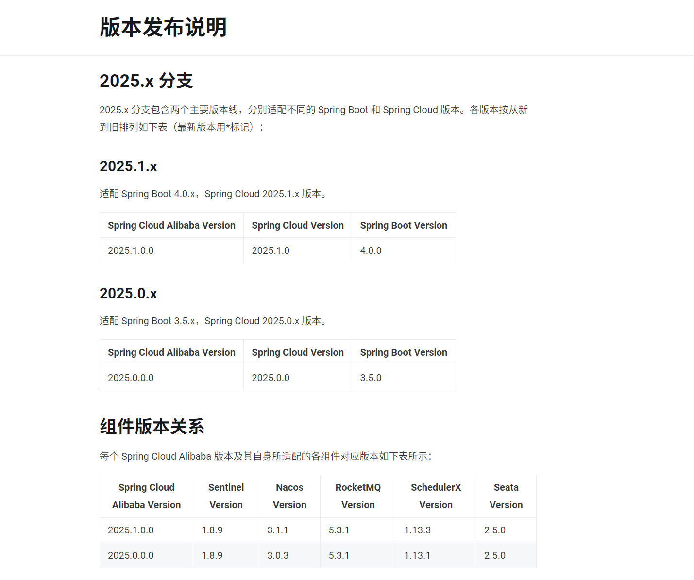

# SpringCloud Alibaba 学习笔记

# SpringCloudAlibaba 的作用

Spring Cloud Alibaba 致力于提供微服务开发的一站式解决方案。此项目包含开发分布式应用微服务的必需组件，  
方便开发者通过 Spring Cloud 编程模型轻松使用这些组件来开发分布式应用服务。

**SpringCloud Alibaba 文档地址 https://sca.aliyun.com/**

## 关于 Spring Cloud

Spring Cloud 本身并不是一个开箱即用的框架，它是一套微服务规范，共有两代实现。  
Spring Cloud Netflix 是 Spring Cloud 的第一代实现，主要由 Eureka、Ribbon、Feign、Hystrix 等组件组成。  
Spring Cloud Alibaba 是 Spring Cloud 的第二代实现，主要由 Nacos、Sentinel、Seata 等组件组成。  

## 组件版本关系
根据官方文档

